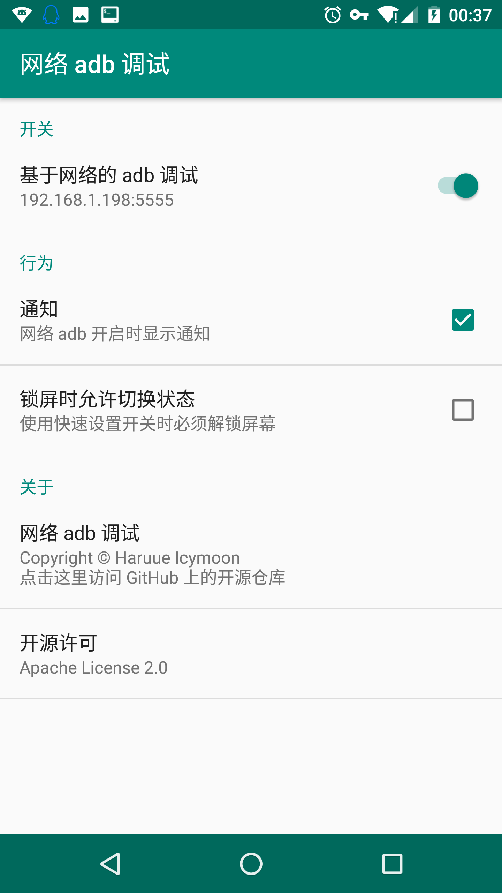
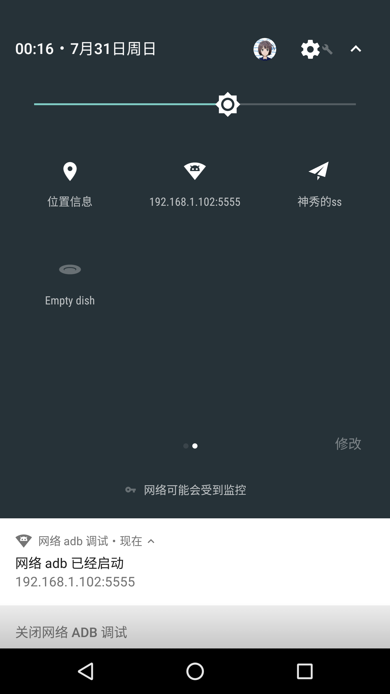

# WADB - 网络 adb 调试开关

[简体中文](README-zh_rCN.md) | [English](README.md)

## 功能

纯粹的对两条命令的封装，开启和关闭网络 adb 调试（修改端口），**需要 root 权限**

```shell
// 开启
setprop service.adb.tcp.port 5555
stop adbd
start adbd

// 关闭
setprop service.adb.tcp.port -1
stop adbd
start adbd

```

主要还是想试一下 Android N 上新加的 [Tile API](https://developer.android.com/preview/api-overview.html#tile_api) ，所以这些效果需要 Android N 才能看到。






## 下载

在 Play 商店支持我们：
<a href='https://play.google.com/store/apps/details?id=moe.haruue.wadb&utm_source=global_co&utm_medium=prtnr&utm_content=Mar2515&utm_campaign=PartBadge&pcampaignid=MKT-Other-global-all-co-prtnr-py-PartBadge-Mar2515-1'></a>

或者 [在这里直接下载 APK](https://github.com/RikkaApps/WADB/releases/latest)

## 翻译

您可以通过 Pull Requst 协助我们把「网络 adb」应用翻译成您熟悉的语言

## License

Apache License 2.0

```License
Copyright 2017 Haruue Icymoon, PinkD, Rikka

Licensed under the Apache License, Version 2.0 (the "License");
you may not use this file except in compliance with the License.
You may obtain a copy of the License at

    http://www.apache.org/licenses/LICENSE-2.0

Unless required by applicable law or agreed to in writing, software
distributed under the License is distributed on an "AS IS" BASIS,
WITHOUT WARRANTIES OR CONDITIONS OF ANY KIND, either express or implied.
See the License for the specific language governing permissions and
limitations under the License.
```
