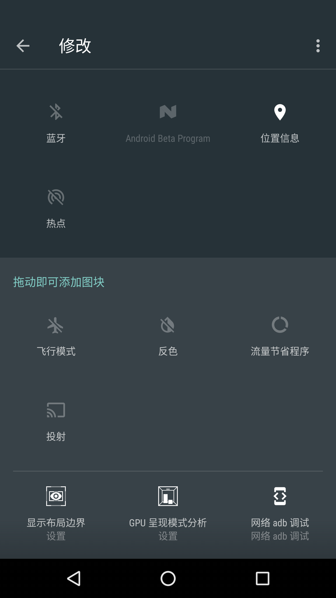
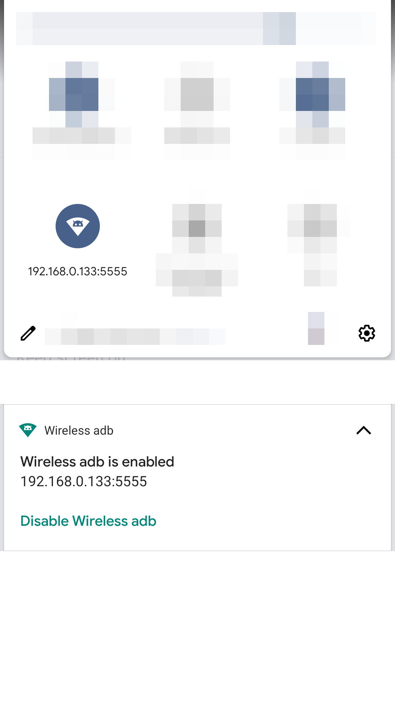
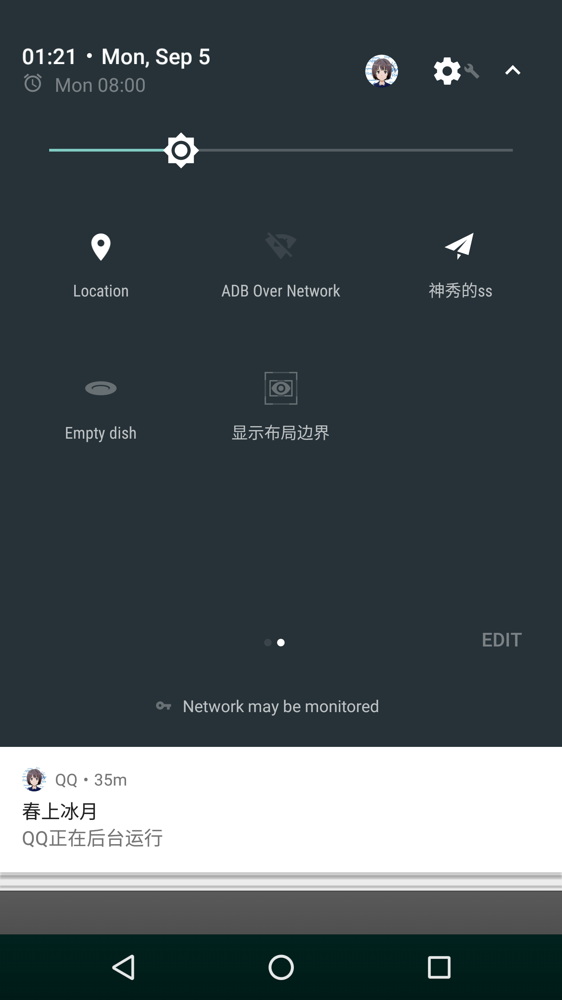

# WADB - a simple switch for ADB over network
[简体中文](README-zh_rCN.md) | [English](README.md)

## Function
switch the state of ADB over network by the following command，**Need root !!!**
```shell
// Start ADB over network
setprop service.adb.tcp.port 5555
stop adbd
start adbd

// Stop ADB over network
setprop service.adb.tcp.port -1
stop adbd
start adbd

```

Support the new [Tile API](https://developer.android.com/preview/api-overview.html#tile_api) which add in Android N, so you need a Android N device to use the tile. But other functions also work well in Android 4.0.

## Screenshot






## Download
Support us in Play Store：    
<a href='https://play.google.com/store/apps/details?id=moe.haruue.wadb&utm_source=global_co&utm_medium=prtnr&utm_content=Mar2515&utm_campaign=PartBadge&pcampaignid=MKT-Other-global-all-co-prtnr-py-PartBadge-Mar2515-1'></a>

... or directly download the APK file by click [here](app/app-release.apk?raw=true).    

## License
Apache License 2.0

```License
Copyright 2016 Haruue Icymoon

Licensed under the Apache License, Version 2.0 (the "License");
you may not use this file except in compliance with the License.
You may obtain a copy of the License at

    http://www.apache.org/licenses/LICENSE-2.0

Unless required by applicable law or agreed to in writing, software
distributed under the License is distributed on an "AS IS" BASIS,
WITHOUT WARRANTIES OR CONDITIONS OF ANY KIND, either express or implied.
See the License for the specific language governing permissions and
limitations under the License.

```
